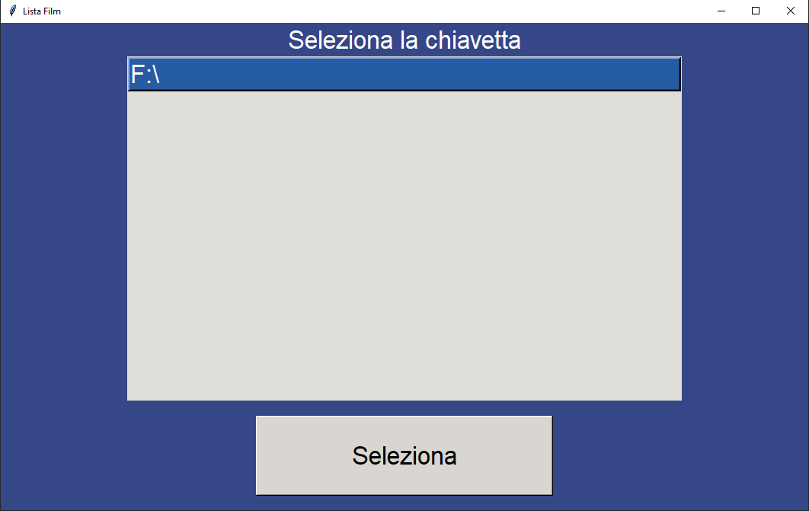
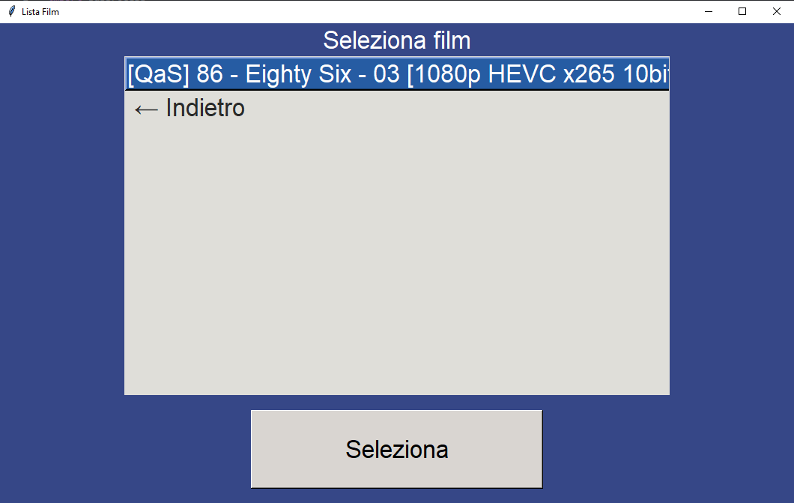

# Simple GUI 4 Films

A really simple GUI made with tkinter to let my grandfather choose from a USB removable key supported video types (.mkv, .avi, .mp4)

## Features

- Easy to understand 
- Select films and USB keys from a list
- Directly open the selected file on VLC in fullscreen
- Supported files easy to change

## Images

